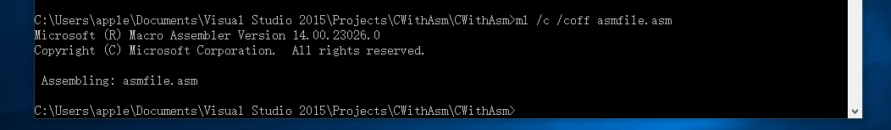
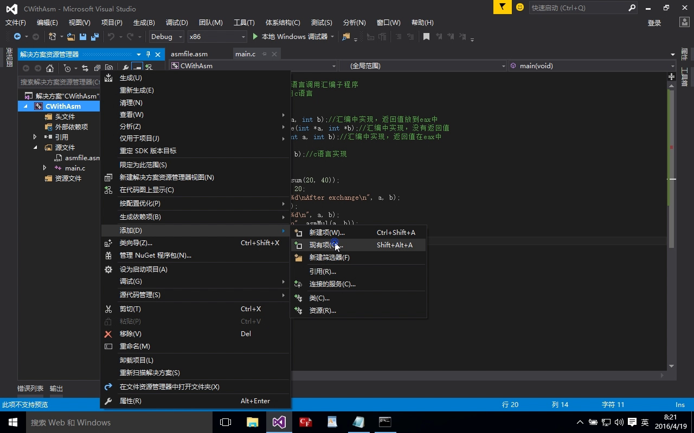
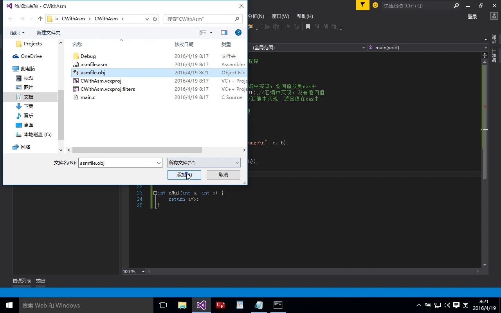
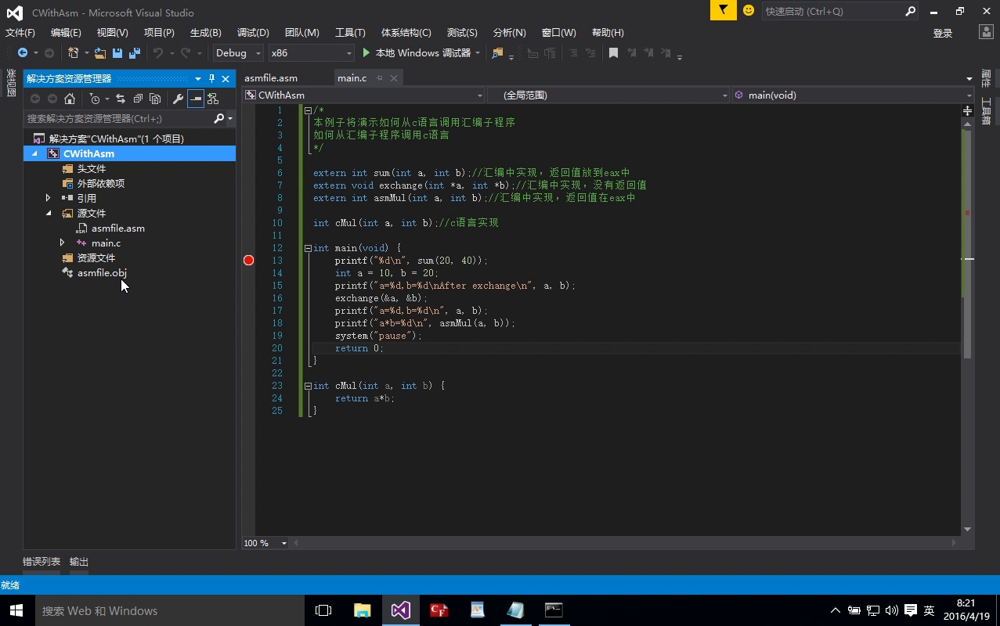

# VS2015，C嵌套汇编 & C,汇编相互调用  
### 环境：VS2015  
### 目标：如何在c语言中嵌入汇编语言，如何在C语言中调用汇编子程序，如何在汇编子程序中调用C函数，如何在汇编子程序中调用lib文件中的函数    

## 1.在C语言中嵌入汇编语句  
这个比较简单，直接上代码  

	#include <stdio.h>
	#pragma inline
	int main(void) {
	int result=0,a = 10, b = 20;
	__asm mov eax, a//嵌入单条汇编语句
	__asm add eax,b
	__asm mov result,eax
	printf("单条汇编语句执行结果->%d+%d=%d\n", a, b, result);
	result = 0;
	__asm {
		//嵌入汇编语句块
		mov eax,a
		add eax,b
		mov result,eax
	}
	printf("汇编语句块执行结果->%d+%d=%d\n", a, b, result);
	system("pause");
	return 0;
	}  
	
## 2.在C语言中调用汇编子程序  
在C语言中调用汇编子程序有如下几个步骤  
1.编写asm文件  
2.使用VS2015中的ml.exe程序编译asm文件，生成obj文件  
3.将obj文件加入项目  
4.在c源文件中声明汇编子程序的函数原型  
5.在c源文件中调用汇编子程序  

具体实现方法  
1.编写asm文件  
下面的这个asm文件简单的实现了对两个数的求和  

	;asmfile.asm文件源代码
	.486;必须加上，使用32位寄存器
	.model flat,c;必须有
	public sum
	;数据区域
	.DATA
	msgs db "Hello World",0

	;代码区域
	.CODE
	;函数实现部分

	sum proc far
	push ebp
	mov ebp,esp
	mov eax,[ebp+8];将第一个参数给eax
	add eax,[ebp+12];将第二个参数和eax相加
	pop ebp
	retn;返回值在eax中
	sum endp
	end;结束，必须有

2.使用VS2015中的ml.exe程序编译asm文件，生成obj文件  
ml.exe程序在这个目录下  
C:\Program Files (x86)\Microsoft Visual Studio 14.0\VC\bin  
不同的vs版本的路径可能不同，但总之是为了找到ml.exe程序  
将这个路径加入环境变量  
然后再命令行中输入  
> 	ml /c /coff asmfile.asm  
 	
  
完成后，会生成一个asmfile.obj文件  

3.将obj文件加入项目  
右键项目名->添加->现有项  
选择asmfile.obj即可  
过程图如下  
  
  
  

4和5就直接上代码，一看就懂  

	#include <stdio.h>
	extern  int sum(int a, int b);//汇编中实现，返回值放到eax中
	int main(void) {
		printf("sum(20,40)=%d\n", sum(20, 40));
		system("pause");
		return 0;
	}

这样就实现了如何在C语言中调用汇编子程序了  

## 3.在汇编子程序中调用C语言函数  
1.编写asmfile.asm文件  
文件代码如下  

	
	.486;必须加上，使用32位寄存器
	.model flat,c;必须有
	public sum
	;这里的sum3实在main.c中实现的，后面的dword说明此函数的参数有两个，每一个都是dword类型的，dword也就是4个字节
	sum3 proto stdcall :dword,:dword
	;代码区域
	.CODE
	;函数实现部分

	;另一种参数传递方法
	sum proc a:dword,b:dword
	invoke sum3,a,b ;此处使用invoke调用sum3函数
	pop ebp;这里必须加上这条指令，因为使用这种参数传递方法的时候，编译时汇编语句中会自动上	push ebp,mov ebp,esp这两条语句
	retn
	sum endp
	
	end;结束，必须有  
	
2.还是向上面那样使用ml程序编译，加入到项目  
3.main.c代码如下  

	#include <stdio.h>
	extern  int sum(int a, int b);//汇编中实现，返回值放到eax中

	extern int __stdcall sum3(int a, int b) {
		//此函数给汇编子程序调用
		return a + b;
	}
	int main(void) {
		printf("sum(20,40)=%d\n", sum(20, 40));
		system("pause");
		return 0;
	}  

## 4.如何在汇编子程序中使用lib中的函数  
1.首先要生成lib，这里有如下两个文件，一个mylib.h,一个mylib.c  
代码如下  
	
	/**mylib.h**/
	#pragma once
	#ifndef _MYLIB_H_
	#define _MYLIB_H_
	extern int __stdcall cMul(int a, int b);
	#endif

	/**mylib.c**/
	#include "mylib.h"
	extern int __stdcall cMul(int a, int b) {
		return a*b;
	}

代码有了，接着就是如何生成lib了，这里要用到cl.exe和lib.exe两个程序，还是在vs2015的vc/bin目录下，输入命令  
> cl /c mylib.c  

此命令将会生成一个mylib.obj文件  
然后使用这个命令
  
> lib /OUT:mylib.lib mylib.obj  

将会生成一个mylib.lib文件  

2.汇编文件中使用lib  
此次的asmfile.asm的源代码如下  
	
	;asmfile.asm文件代码
	.486;必须加上，使用32位寄存器
	.model flat,c;必须有
	public asmMul
	includelib mylib.lib ;次数使用includelib伪指令包含mylib.lib，这个mylib.lib文件必须和asmfile.asm文件在同一个目录下，如果不在同一个目录下就必须指定路径，写成 includelib C:\..\...\mylib.lib
	cMul PROTO STDCALL :DWORD,:DWORD

	;代码区域
	.CODE
	;函数实现部分

	asmMul proc far
	push ebp
	mov ebp,esp
	invoke cMul,[ebp+8],[ebp+12]
	pop ebp
	retn
	asmMul endp
	end;结束，必须有
	
然后使用ml文件编译asm文件，加入项目即可  